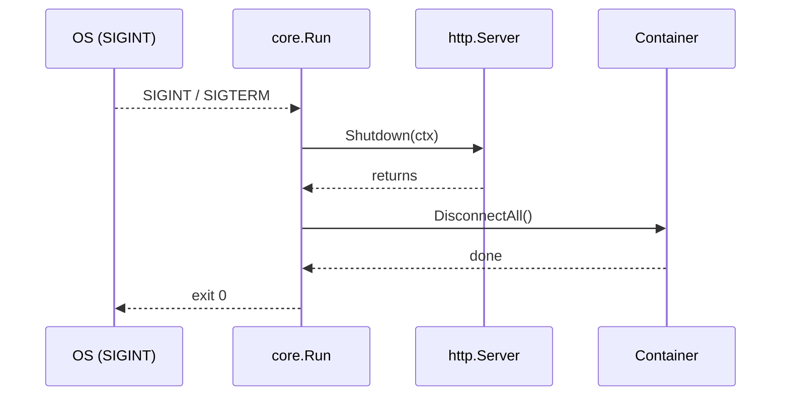

# Core in `genes`

`appvital.Core` is the **central application object** in the genes framework.  It owns:

* the HTTP server & router trees
* a per-application dependency container
* graceful-shutdown orchestration
* request context pooling
* client-IP utilities via `IPResolver`

> All incoming requests eventually hit `ServeHTTP` implemented via the embedded router – every handler receives a `*appvital.Context` created by `Core`.

---
## Anatomy

```go
// abridged
 type Core struct {
     httpServer               // router + ServeHTTP implementation
     container *container.Container

     *appvital.IPResolver     // helper for real client IP
 }
```

Key fields:

1. **httpServer** – internal type (see `appvital/http_server.go`) that embeds routing logic and implements `ServeHTTP`.
2. **container** – lightweight service-locator used throughout the app (loggers, databases, etc.).
3. **IPResolver** – strategy object to resolve client IP (respecting proxies).

---
## Lifecycle

| Stage | Method(s) | What happens |
|-------|-----------|--------------|
| Construction | `var core appvital.Core{}` | zero-value is fine. |
| HTTP setup | `core.NewHttpServerSetup()` |   * Creates routing trees<br>  * Enables pprof<br>  * Injects context pooling function |
| Container setup | `core.NewContainerSetup()` | Initialises `core.container` with default logger + mongo client. |
| Route registration | `core.GET(...)`, `core.Use(...)` etc. (via embedded `RouterGroup`) | Adds handlers to router trees. |
| Run | `core.Run(":8080")` |   * Starts HTTP server in goroutine<br>  * Listens for `SIGINT/SIGTERM`<br>  * Performs graceful shutdown & dependency disconnect |

---
## Important methods

| Method | Purpose | Typical use-case |
|--------|---------|------------------|
| `NewHttpServerSetup()` | Prepare routing & context pool. | Call early in `main()` before adding routes. |
| `NewContainerSetup()` | Create default container with logger & mongo. | Immediately after `NewHttpServerSetup()`. |
| `Use(mw ...HandlerFunc)` | Register global middleware. | Logging, CORS, recovery. |
| `addRoute(method, path, handlers)` | (internal) Adds a route to tree. | Called by `GET/POST/...` wrappers. |
| `NoRoute(handlers...)` | Custom 404 handler chain. | Return JSON `{error:"not found"}`. |
| `NoMethod(handlers...)` | Custom 405 handler chain. | Return "method not allowed" JSON. |
| `DefaultContext(maxParams)` | Build a fresh `*appvital.Context` with pre-allocated params slice. | Used by pool. |
| `ContextPool()` | Factory fed to `sync.Pool`. | Internal. |
| `Run(port)` | Start server & graceful shutdown. | Blocking call in `main()`. |

---
## Quick start example

```go
package main

import (
	"genes"
	middleware "genes/http/middleware"
)

func main() {
	core := genes.New()

	// use middleware
	core.Use(middleware.Recover)

	// add routing group
	group := core.Group("/api")

	// routes
	group.GET("/hello", func(ctx *genes.Context) {
		ctx.SuccResponse("Hey you hits me successfully....", map[string]any{"say": "hallo"})
	})

	core.Run(":8080")
}
```

---
## Graceful shutdown flow



---
## Extending the container

`core.container` is exposed to handlers through `Context.Container`.  You can register new services during startup:

```go
func MongoSetup(core *genes.Core) {
	// Set a timeout context for the initial connection
	ctx, cancel := context.WithTimeout(context.Background(), 10*time.Second)
	defer cancel()

	// MongoDB connection options
	opts := options.Client().ApplyURI("mongodb://localhost:27017/")
	// Add the Mongo client to the app container using the exposed interface
	core.SetMongo().AddClient(ctx, "local", opts)
}
```

Inside any handler:

```go
func InsertPersist(ctx *genes.Context) {
	ctx.LogLevel(logger.DEBUG)
	db := ctx.Mongo.GetDatabase("local", "mongo")
	_, err := db.Collection("mongo").InsertOne(context.TODO(), bson.M{"name": "navjot"})
	ctx.Debug(err)
}
```

---
*Happy hacking with Core!* 